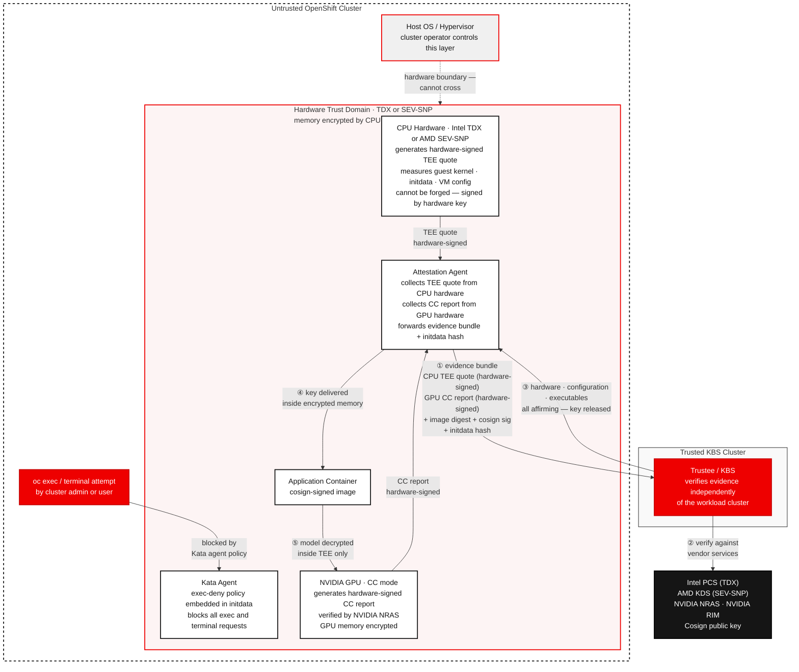
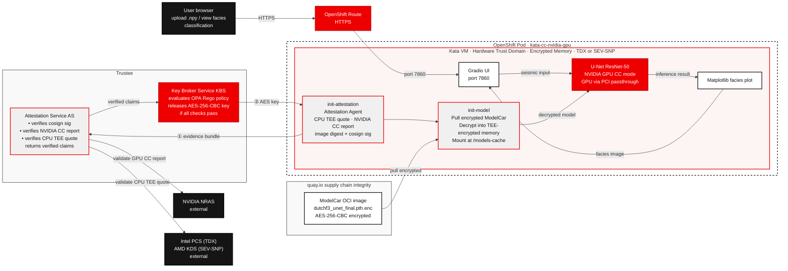

# Confidential GPU-Accelerated Seismic Interpretation

AI-powered classification from North Sea seismic data — running with a three-factor attested, encrypted model in a confidential container on OpenShift AI.

## Table of contents

- [Detailed description](#detailed-description)
  - [Who is this for?](#who-is-this-for)
  - [The business case for AI-driven seismic interpretation](#the-business-case-for-ai-driven-seismic-interpretation)
  - [Why the cluster is not the security boundary](#why-the-cluster-is-not-the-security-boundary)
  - [What this quickstart provides](#what-this-quickstart-provides)
  - [What you'll build](#what-youll-build)
  - [Architecture diagram](#architecture-diagram)
- [Requirements](#requirements)
  - [Minimum hardware requirements](#minimum-hardware-requirements)
  - [Minimum software requirements](#minimum-software-requirements)
  - [Network connectivity requirements](#network-connectivity-requirements)
  - [Required user permissions](#required-user-permissions)
- [Deploy](#deploy)
  - [Clone the repository](#clone-the-repository)
  - [Hardware prerequisite: Enable TEE in server firmware and kernel parameters](#hardware-prerequisite-enable-tee-in-server-firmware-and-kernel-parameters)
  - [Roles](#roles)
  - [Kata containers setup — application deployer (cluster-admin, once per cluster)](#kata-containers-setup--application-deployer-cluster-admin-once-per-cluster)
    - [Step 1: Install Node Feature Discovery](#step-1-install-node-feature-discovery)
    - [Step 2: Install OpenShift Sandboxed Containers](#step-2-install-openshift-sandboxed-containers)
    - [Step 3: Configure GPU Operator for confidential containers](#step-3-configure-gpu-operator-for-confidential-containers)
    - [Step 4: Extend the kubelet container-creation timeout](#step-4-extend-the-kubelet-container-creation-timeout)
  - [Intel TDX Quote Generation Service setup — application deployer (cluster-admin, once per cluster, Intel TDX only)](#intel-tdx-quote-generation-service-setup--application-deployer-cluster-admin-once-per-cluster-intel-tdx-only)
    - [Step 1: Install the Intel Device Plugin Operator](#step-1-install-the-intel-device-plugin-operator)
    - [Step 2: Install the Intel TDX DCAP Operator and deploy QGS](#step-2-install-the-intel-tdx-dcap-operator-and-deploy-qgs)
  - [Trustee setup — model owner (cluster-admin, once per cluster)](#trustee-setup--model-owner-cluster-admin-once-per-cluster)
    - [Step 1: Install the Trustee operator](#step-1-install-the-trustee-operator)
    - [Step 2: Create the cert-manager Issuer and TLS Certificates](#step-2-create-the-cert-manager-issuer-and-tls-certificates)
    - [Step 3: Create the NRAS API key Secret](#step-3-create-the-nras-api-key-secret)
    - [Step 4: Deploy KBS](#step-4-deploy-kbs)
    - [Step 5: Verify the KBS route and set HAProxy timeout](#step-5-verify-the-kbs-route-and-set-haproxy-timeout)
    - [Step 6: Register RVPS reference values](#step-6-register-rvps-reference-values)
    - [Step 7: Register app-specific secrets with KBS](#step-7-register-app-specific-secrets-with-kbs)
  - [Application deployment — application deployer (namespace admin)](#application-deployment--application-deployer-namespace-admin)
    - [Step 1: Create the project](#step-1-create-the-project)
    - [Step 2: Deploy the application](#step-2-deploy-the-application)
    - [Step 3: Get the application URL](#step-3-get-the-application-url)
  - [Use the application](#use-the-application)
    - [Upload seismic data](#upload-seismic-data)
    - [Run classification](#run-classification)
    - [View results](#view-results)
  - [Verify confidential execution (Optional)](#verify-confidential-execution-optional)
  - [Optional: Encrypt and publish your own model — model owner](#optional-encrypt-and-publish-your-own-model--model-owner)
  - [Optional: Build and publish your own application — model owner](#optional-build-and-publish-your-own-application--model-owner)
  - [What you've accomplished](#what-youve-accomplished)
  - [Delete](#delete)
- [Tags](#tags)

---

## Detailed description

### Who is this for?

This quickstart is designed for:

- **Petroleum engineers and geoscientists** who want to see AI applied to real subsurface field data without building a pipeline from scratch
- **Data scientists and ML engineers** exploring GPU-accelerated deep learning in the geoscience domain
- **Platform and security engineers** demonstrating confidential computing with GPU passthrough on OpenShift — using real, sensitive-class data as the workload

No prior seismic interpretation experience is required. Domain context is provided where needed.

### The business case for AI-driven seismic interpretation

Before drilling a well, geoscientists must answer a fundamental question: **where is the reservoir rock?**

The traditional answer involves a geologist manually interpreting a 3D seismic volume — tracing rock boundaries line by line through thousands of 2D cross-sections. A full field interpretation takes **weeks to months** of senior geologist time and reflects a single interpreter's judgement.

AI-driven seismic facies classification changes this:

| | Manual interpretation | AI model (this quickstart) |
|---|---|---|
| Time to full-field interpretation | Weeks–months | Minutes |
| Coverage | Sampled 2D sections | Every point in the 3D volume |
| Consistency | Interpreter-dependent | Deterministic |
| Cost | Senior geologist time | GPU compute |
| Scenario runs | 1–2 | Unlimited |

**The downstream impact is significant.** A better rock type map leads to better well placement decisions — and a single well in the North Sea costs $50M–$150M to drill. AI-assisted interpretation directly reduces the risk of drilling in the wrong location.

**Why confidential computing matters here.** Seismic data is among the most commercially sensitive assets an oil and gas company owns. Running AI interpretation on proprietary field data in a shared cloud or on-premises cluster exposes that data to the underlying infrastructure. Confidential computing hardware encrypts the memory of the inference process — the seismic data and model weights are never visible to the host OS, hypervisor, or any user with physical access to the node. To prevent authorized users of the application from exfiltrating decrypted data via a shell, the Kata agent running inside the Trust Domain is configured with a policy that forbids exec and terminal access into the container. This exec-deny policy is embedded in the container's initdata, whose hash is included in the TEE attestation evidence — the KBS will only release the model decryption key to a pod carrying the correct initdata hash, making exec prevention a cryptographically enforced condition of key release rather than a Kubernetes policy that an administrator could bypass. This quickstart uses Intel® TDX (Trust Domain Extensions) or AMD SEV-SNP on AMD EPYC platforms for CPU memory encryption. NVIDIA data center GPUs that support Confidential Computing mode (H100, H200, B100 and later) extend this protection to the GPU: GPU memory and the PCIe bus between CPU and GPU are also encrypted, closing the gap that would otherwise exist between the CPU Trust Domain and the accelerator.

### Why the cluster is not the security boundary

In a conventional container deployment, the cluster operator controls everything: the host OS, the container runtime, and the network. Any workload running on their cluster is ultimately visible to them — they can inspect container memory, attach a debugger, or intercept traffic. Trusting a workload therefore means trusting the operator of the cluster it runs on. This is the model most software assumes, and it is why sensitive AI inference is typically restricted to clusters that the data owner fully controls.

Confidential computing breaks this assumption. The hardware Trust Domain (Intel® TDX or AMD SEV-SNP) is enforced by the CPU itself — the host OS and hypervisor cannot read or modify memory inside it, regardless of what privileges they hold. The model decryption key is held by Trustee, which runs on a separate trusted cluster and releases the key only after independently verifying cryptographic evidence produced inside the TEE. Trustee does not ask the cluster whether it is trustworthy — it verifies the hardware directly. This means the workload cluster can be considered fully untrusted: even if an attacker controls the entire cluster, they cannot forge a valid CPU attestation quote, cannot fake the GPU Confidential Computing mode report, and cannot produce a valid cosign signature for the application image. Without all three, Trustee will not release the key, and the model cannot be decrypted.

Everything that touches sensitive data runs inside the secure VM, and none of it can be influenced by the untrusted cluster. The kata VM boots its own isolated guest kernel — separate from the host kernel that OpenShift controls — and every component inside it is part of the attestation measurement. The kata agent, which controls what processes run inside the VM, is supplied via the initdata blob whose hash KBS verifies. The Confidential Data Hub, which fetches the decryption key from KBS, runs inside the TEE and communicates with KBS over a TLS channel that the host network stack cannot intercept. The application container image is verified by cosign as part of attestation, so the cluster cannot substitute a different image without breaking the signature check. The cluster can schedule the pod and stop it, but it cannot change what runs inside the VM, modify the kata-agent policy, intercept the key in transit, or read the decrypted model from memory. The only role the untrusted cluster plays is to start the VM — everything after that is under hardware enforcement.

Memory encryption alone is not sufficient — an authorized user with `oc exec`, terminal access, or `oc cp` could still extract decrypted data at runtime by interacting with the running process or copying files out of it. To close this gap, the Kata agent inside the Trust Domain is configured with a policy that forbids exec, terminal, and file copy operations entirely. This exec-deny policy is embedded in the pod's initdata blob, and the hash of that initdata is included in the TEE attestation evidence sent to Trustee. Trustee's attestation policy requires the correct initdata hash to be present before releasing the key — meaning a pod that does not include the exec-deny policy will produce a different hash, fail attestation, and never receive the decryption key. Exec prevention is therefore not a Kubernetes policy that a cluster administrator could remove; it is a cryptographically enforced condition of key release, verified by hardware.

One attack surface that hardware and policy controls cannot eliminate is the behaviour of the application container itself. A container that intentionally exposes decrypted data — through an unauthenticated HTTP endpoint, an overly broad API response, or any other means — would undermine the protections above regardless of how well the TEE is configured. This is why the cosign image signature is a required attestation check: Trustee will only release the model decryption key to a container image that has been signed by the model owner's private key. The model owner is therefore responsible for ensuring that the signed image only exposes data in the intended way, and that no debug endpoints, data dump routes, or unintended egress paths exist. Any future version of the image must be re-signed by the model owner before it can receive the key — giving the model owner, not the cluster operator or application deployer, final control over what code runs inside the Trust Domain.



### What this quickstart provides

- ✓ A browser-based application for uploading, classifying, and visualising seismic data
- ✓ A U-Net ResNet-50 model trained on the Dutch F3 benchmark dataset (MIT license — commercial use permitted), published as an AES-256-CBC encrypted ModelCar OCI image at `quay.io/rh-ai-quickstart/conf-gpu-accel-seismic-interp-model:v1`
- ✓ A [Trustee](https://github.com/confidential-containers/trustee) Key Broker Server that enforces a three-factor attestation policy before releasing the model decryption key
- ✓ Inference running inside a **Kata confidential container** backed by **Intel® TDX or AMD SEV-SNP** — seismic data and decrypted model weights protected in encrypted CPU memory, with GPU memory and the PCIe bus also encrypted via **NVIDIA Confidential Computing mode**
- ✓ GPU passthrough to the hardware Trust Domain via `kata-cc-nvidia-gpu` runtime
- ✓ Colour-coded facies cross-section displayed in the browser alongside the seismic input

### What you'll build

A containerised web application running on OpenShift that:

1. Pulls an encrypted ModelCar OCI image from `quay.io/rh-ai-quickstart/conf-gpu-accel-seismic-interp-model:v1`
2. Verifies a three-factor attestation policy via the Key Broker Server — the application container (`conf-gpu-accel-seismic-interp-app:v1`) must be cosign-signed by the model owner, the GPU must be in NVIDIA CC mode, and the CPU must be in a hardware TEE (Intel® TDX or AMD SEV-SNP) — and receives the AES-256-CBC decryption key only if all three pass
3. Decrypts the model weights inside the hardware Trust Domain — in encrypted memory
4. Presents a browser UI where a user uploads a `.npy` seismic section (depth × crossline, float32)
5. Runs U-Net ResNet-50 inference on a GPU, classifying every pixel as one of six North Sea rock types
6. Displays a colour-coded facies classification alongside the seismic input in the browser

#### Key technologies you'll learn

**Data**
- [Dutch F3 Benchmark Dataset](https://doi.org/10.5281/zenodo.3755060) — open North Sea seismic benchmark with six annotated facies classes (MIT license)

**Model**
- U-Net ResNet-50 ([segmentation-models-pytorch](https://github.com/qubvel/segmentation_models.pytorch)) — trained on the Dutch F3 benchmark dataset for six-class seismic facies segmentation (MIT license)
- [ModelCar](https://developers.redhat.com/articles/2024/10/22/how-to-use-modelcar-serve-ai-models-openshift-ai) — OCI image pattern for packaging and distributing model artifacts through a standard container registry

**Confidential computing**
- [Intel® TDX (Trust Domain Extensions)](https://www.intel.com/content/www/us/en/developer/tools/trust-domain-extensions/overview.html) or [AMD SEV-SNP](https://www.amd.com/en/developer/sev.html) — hardware-level CPU memory encryption for the inference process
- [NVIDIA Confidential Computing](https://www.nvidia.com/en-us/data-center/solutions/confidential-computing/) — NVIDIA GPU running in CC mode (H100, H200, B100 and later), attestation via NVIDIA Remote Attestation Service (NRAS)
- [Kata Containers](https://katacontainers.io/) with `kata-cc-nvidia-gpu` runtime — GPU passthrough into the hardware Trust Domain
- [Trustee (KBS)](https://github.com/confidential-containers/trustee) — Key Broker Server enforcing three-factor attestation before releasing the model decryption key
- [Cosign / Sigstore](https://docs.sigstore.dev/cosign/overview/) — container image signing, verified as part of the KBS attestation policy

**Platform**
- [Red Hat OpenShift](https://www.redhat.com/en/technologies/cloud-computing/openshift) with the OpenShift sandboxed containers operator
- NVIDIA GPU with Confidential Computing mode support (H100, H200, B100 and later) with physical GPU (`pgpu`) passthrough and NVIDIA CC mode enabled

**Application**
- [Gradio](https://www.gradio.app/) — browser-based file upload, visualisation, and download UI
- [Matplotlib](https://matplotlib.org/) — facies cross-section rendering

### Architecture diagram



---

## Requirements

### Minimum hardware requirements

| Component | Minimum | Notes |
|---|---|---|
| GPU | NVIDIA GPU with Confidential Computing mode support (e.g. H100, H200, B100) | Hopper architecture and later support NVIDIA CC mode and NRAS attestation. Consumer GPUs (RTX 3090, RTX 4090) and older data center GPUs (A100) do not support CC mode and cannot pass the NVIDIA attestation check. |
| CPU | Intel® Xeon 5th Gen+ (Emerald Rapids) with TDX, or AMD EPYC 9004 series (Genoa) with SEV-SNP | TEE must be enabled in the BIOS. Earlier CPU generations may not support TDX or SEV-SNP. |
| RAM | 128GB | The kata VM takes 24GB, OCP control plane requires ~32GB, and GPU/OSC/Trustee system pods consume additional memory. 64GB is insufficient in practice. |
| Storage | 50GB | For ModelCar image cache |

**NOTE:** A CPU TEE (Intel® TDX or AMD SEV-SNP) and NVIDIA CC mode are **both** hard requirements — the Key Broker Server will not release the model decryption key unless all three attestation checks pass.

### Minimum software requirements

| Software | Version | Notes |
|---|---|---|
| OpenShift Container Platform | 4.21.24+ | Required by OpenShift Sandboxed Containers 1.13 with confidential containers and GPU support (bare metal + GPU requires 4.21.24+) |
| Red Hat OpenShift AI | 3.4+ | Provides the model serving stack and installs the NVIDIA GPU Operator (26.3.0 required for confidential GPU support with OSC 1.13) and CUDA runtime — install via OperatorHub |
| Trustee (KBS) | 1.1.0 | `confidential-containers/trustee` — Key Broker Server, deployed as part of this quickstart |
| Cosign | 2.0+ | For verifying model image signatures; installed locally for the optional encrypt step |

### Network connectivity requirements

Attestation requires outbound HTTPS (port 443) access from the clusters to the following external services:

| From | Destination | Purpose |
|---|---|---|
| Workload cluster (Intel TDX only) | `api.trustedservices.intel.com` | Intel PCS — PCCS fetches PCK certificates from here to supply the QGS with material for building TDX attestation quotes. |
| Trustee cluster (Intel TDX) | `api.trustedservices.intel.com` | Intel PCS — verifies the PCK certificate chain and checks TCB status and CRL during TDX quote verification. |
| Trustee cluster (AMD SEV-SNP) | `kdsintf.amd.com` | AMD Key Distribution Service (KDS) — fetches the VCEK (Versioned Chip Endorsement Key) certificate used to verify SEV-SNP attestation reports against AMD's root CA. |
| Trustee cluster | `nras.attestation.nvidia.com` | NVIDIA Remote Attestation Service — verifies GPU attestation reports |
| Trustee cluster | `rim.attestation.nvidia.com` | NVIDIA RIM Service — fetches GPU firmware reference integrity manifests |
| Trustee cluster | `ocsp.ndis.nvidia.com` | NVIDIA OCSP — GPU certificate revocation checks |

> In a restricted network environment, `api.trustedservices.intel.com` can be replaced by a locally deployed PCCS instance (see the note in the hardware prerequisite section). AMD does not provide an equivalent local caching service for KDS, but VCEK certificates can be pre-fetched and cached. Local mirroring of the NVIDIA RIM and OCSP services may also be possible — refer to the [NVIDIA Attestation documentation](https://docs.nvidia.com/attestation/index.html) for details.

### Required user permissions

This quickstart separates one-time platform setup (done by a platform team) from per-deployment application work (done by application teams). Most users only need namespace-level access.

**Platform setup (cluster-admin, done once per cluster):**
- Installing the OpenShift Sandboxed Containers, NFD, and NVIDIA GPU operators — these create cluster-scoped CRDs and ClusterRoles
- Creating `KataConfig` and `NodeFeatureRule` — cluster-scoped resources

**Application deployment (no cluster-admin required):**

| Task | Minimum role |
|---|---|
| Create the `trustee-system` project | `self-provisioner` — the built-in OpenShift role that lets authenticated users create their own projects; assigned to all users by default |
| Deploy and configure the KBS | `admin` on the `trustee-system` namespace |
| Create the `seismic-interpretation` project | `self-provisioner` |
| Deploy the application, create secrets and routes | `edit` on the `seismic-interpretation` namespace |

---

## Deploy

### Roles

This quickstart involves two distinct parties. Each section is labeled with which role performs it.

**Model owner** — owns the model weights and decides which application code is permitted to decrypt them. Generates signing keys, encrypts and signs the model and application images, operates Trustee/KBS, and registers secrets with KBS. The model decryption key never leaves Trustee — it is released only after attestation passes. The model owner never shares the key with the application deployer.

**Application deployer** — operates the OpenShift cluster where the application runs. Installs kata confidential containers infrastructure, deploys the application, and uses it. Has no access to the model decryption key or to Trustee administration.

> **Quickstart simplification:** In this quickstart both roles are performed by one person and Trustee runs on the same cluster as the application for demo convenience. In production, Trustee would run on infrastructure controlled by the model owner, separate from the application cluster. Steps 1–5 of Trustee setup would be performed by whoever operates that infrastructure; Steps 6 and 7 and both Optional sections are always model owner responsibilities.

### Clone the repository

```bash
git clone https://github.com/rh-ai-quickstart/confidential-gpu-accelerated-seismic-interpretation
cd confidential-gpu-accelerated-seismic-interpretation
```

Sample `.npy` seismic sections from the Dutch F3 dataset are included in the `samples/` directory of the repository — use these to try the application without any additional data download.

### Set your deployment namespace

All `make` commands and shell snippets in this guide use a `NAMESPACE` variable for the OpenShift namespace where the application will be deployed. Set and export it once in your shell now — it will carry through the session without needing to be re-specified in each command.

The default namespace used in this quickstart is `seismic-interpretation`:

```bash
export NAMESPACE=seismic-interpretation
```

Use any name you prefer. The namespace is created in [Step 1 of Application deployment](#step-1-create-the-project).

### Hardware prerequisite: Enable TEE in server firmware and kernel parameters

Confidential containers require a hardware Trusted Execution Environment (TEE). This is a one-time server configuration done via your BMC/IPMI console by whoever manages the bare metal hosts. The BIOS settings and kernel parameters must be applied before the kata containers setup below.

#### Configure BIOS firmware

**Intel TDX (Intel Xeon Scalable 4th Gen / Sapphire Rapids or later)**

Access the BIOS setup utility via your BMC/IPMI console. Navigate to **Socket Configuration → Processor Configuration** and set:

| Setting | Required value | Notes |
|---|---|---|
| Memory Encryption (TME) | Enabled | Required by TDX |
| Total Memory Encryption Multi-Tenant (TME-MT) | Enabled | Required by TDX |
| Trust Domain Extension (TDX) | Enabled | |
| TDX Secure Arbitration Mode Loader (SEAM Loader) | Enabled | |
| TME-MT/TDX key split | Any non-zero value (e.g. 32) | Sets how many concurrent TDX VMs are supported |
| SW Guard Extensions (SGX) | Enabled | Required for TDX attestation infrastructure |
| SGX Factory Reset | Enabled | Required for remote attestation |

Save and reboot the server. Full Intel hardware setup guide: https://cc-enabling.trustedservices.intel.com/intel-tdx-enabling-guide/04/hardware_setup/

After the server comes back, verify TDX is active:

```bash
# List worker nodes to identify the target hardware node:
oc get nodes -l node-role.kubernetes.io/worker -o custom-columns=NAME:.metadata.name --no-headers
# Set NODE to the target node (auto-detected on single-node clusters):
NODE=$(oc get nodes -l 'node-role.kubernetes.io/worker,!node-role.kubernetes.io/master' \
    -o jsonpath='{.items[0].metadata.name}' 2>/dev/null || \
    oc get nodes -l node-role.kubernetes.io/worker \
    -o jsonpath='{.items[0].metadata.name}')
oc debug node/$NODE -- chroot /host dmesg | grep -i tdx
```

Expected output includes `virt/tdx: BIOS enabled` and `virt/tdx: module initialized`. If you see no tdx lines, the BIOS settings were not saved correctly.

**AMD SEV-SNP (AMD EPYC)**

Access the BIOS setup utility and enable SEV-SNP under the memory/security settings (path varies by server vendor — consult your server's BIOS reference manual). Verify with:

```bash
# List worker nodes to identify the target hardware node:
oc get nodes -l node-role.kubernetes.io/worker -o custom-columns=NAME:.metadata.name --no-headers
# Set NODE to the target node (auto-detected on single-node clusters):
NODE=$(oc get nodes -l 'node-role.kubernetes.io/worker,!node-role.kubernetes.io/master' \
    -o jsonpath='{.items[0].metadata.name}' 2>/dev/null || \
    oc get nodes -l node-role.kubernetes.io/worker \
    -o jsonpath='{.items[0].metadata.name}')
oc debug node/$NODE -- chroot /host dmesg | grep -i snp
```

#### Apply kernel parameters

<details open>
<summary>Make instructions</summary>

To automatically apply the TEE kernel parameters (cluster-admin required):

```bash
make setup-intel-tee    # Intel Xeon with TDX
# or
make setup-amd-tee      # AMD EPYC with SEV-SNP
```

</details>

<details>
<summary>Manual instructions</summary>

To manually apply the TEE kernel parameters:

The node must boot with TDX kernel parameters active before the OSC operator can install kata-cc. This step applies two MachineConfigs and triggers a node reboot.

> **NOTE for multi-node clusters:** The MachineConfigs below use `role: master`. On multi-node clusters where kata workloads run on worker nodes, change `machineconfiguration.openshift.io/role: master` to `worker` in both blocks before applying.

> **NOTE for AMD SEV-SNP clusters:** Skip the TDX block. Apply only the IOMMU block — SNP is enabled entirely via BIOS with no additional kernel parameters.

Apply the TDX kernel parameters (Intel only):

```bash
oc apply -f - <<'EOF'
apiVersion: machineconfiguration.openshift.io/v1
kind: MachineConfig
metadata:
  name: 99-enable-intel-tdx
  labels:
    machineconfiguration.openshift.io/role: master
spec:
  config:
    ignition:
      version: 3.5.0
    storage:
      files:
        - path: /etc/modules-load.d/vsock.conf
          mode: 0644
          contents:
            source: "data:,vsock-loopback%0A"
        - path: /etc/kata-containers/kata-tdx/config.d/96-kata-kernel-config
          mode: 0644
          contents:
            source: "data:text/plain;charset=utf-8;base64,W2h5cGVydmlzb3IucWVtdV0KdGR4X3F1b3RlX2dlbmVyYXRpb25fc2VydmljZV9zb2NrZXRfcG9ydD0wCg=="
        - path: /etc/kata-containers/kata-tdx-nvidia-gpu/config.d/96-kata-kernel-config
          mode: 0644
          contents:
            source: "data:text/plain;charset=utf-8;base64,W2h5cGVydmlzb3IucWVtdV0KdGR4X3F1b3RlX2dlbmVyYXRpb25fc2VydmljZV9zb2NrZXRfcG9ydD0wCg=="
  kernelArguments:
    - kvm_intel.tdx=1
    - nohibernate
EOF
```

The two `config.d` files set `tdx_quote_generation_service_socket_port=0`, disabling QEMU vsock quote generation and enabling kernel-mediated TDX attestation via the QGS unix socket (required for OSC 1.13+).

Apply the IOMMU passthrough parameters (required for GPU passthrough to kata VMs):

```bash
oc apply -f - <<'EOF'
apiVersion: machineconfiguration.openshift.io/v1
kind: MachineConfig
metadata:
  name: 100-iommu-kernel-args
  labels:
    machineconfiguration.openshift.io/role: master
spec:
  kernelArguments:
    - intel_iommu=on
    - amd_iommu=on
    - iommu=pt
EOF
```

Wait for the node to reboot and return to Ready:

```bash
# Single-node — API server will be briefly unreachable during reboot:
oc wait mcp/master --for=condition=Updated=True --timeout=30m
```

On single-node clusters the API server itself reboots during this wait, so the command will disconnect for 2–5 minutes. Re-run it once the cluster is reachable again.

After the node comes back, verify TDX is active in the kernel:

```bash
# List worker nodes to identify the target hardware node:
oc get nodes -l node-role.kubernetes.io/worker -o custom-columns=NAME:.metadata.name --no-headers
# Set NODE to the target node (auto-detected on single-node clusters):
NODE=$(oc get nodes -l 'node-role.kubernetes.io/worker,!node-role.kubernetes.io/master' \
    -o jsonpath='{.items[0].metadata.name}' 2>/dev/null || \
    oc get nodes -l node-role.kubernetes.io/worker \
    -o jsonpath='{.items[0].metadata.name}')
oc debug node/$NODE -- chroot /host dmesg | grep -i tdx
# Expected: "virt/tdx: BIOS enabled" and "virt/tdx: module initialized"
```

</details>

To validate all hardware and software prerequisites before proceeding:

```bash
make check-prereqs
```

> **Intel TDX: Provisioning Certificate Caching Service (PCCS)**
>
> When a TDX pod generates an attestation quote, the quote must be verified against Intel's certificate chain to prove the CPU is genuine Intel hardware running legitimate TDX firmware. By default, the attestation agent fetches these certificates directly from Intel's online Provisioning Certificate Service (PCS) on each attestation.
>
> Running a local **Provisioning Certificate Caching Service (PCCS)** is recommended even when outbound internet access is not restricted, for several reasons:
> - **Reliability** — attestation does not fail if Intel's online PCS is temporarily unavailable.
> - **Performance** — a local cache eliminates per-attestation round-trip latency to Intel's servers.
> - **Privacy** — without PCCS, every TDX node calls Intel's PCS directly, letting Intel observe per-platform activity. With PCCS, only the caching service contacts Intel.
> - **Compliance** — in regulated environments, having a single auditable egress point for Intel certificate fetching is easier to control than every node reaching the internet independently.
>
> PCCS only serves Intel-signed certificates — a compromised PCCS cannot forge trust or produce fake attestation quotes, since all certificates are verified against Intel's root CA. However, a stale or tampered PCCS could serve outdated revocation lists (CRLs) or TCB (Trusted Computing Base) data, which would prevent the system from detecting known vulnerabilities in platform firmware. For this reason, PCCS should run on trusted, well-maintained infrastructure — not on the same untrusted workload cluster — and should be kept updated so that revocation and TCB information stays current.
>
> This quickstart deploys QGS via the Intel TDX DCAP Operator using `platformRegistration.Online` — QGS contacts Intel PCS directly with an API key, so no local PCCS is required. AMD SEV-SNP does not require QGS or PCCS.

---

### Kata containers setup — application deployer (cluster-admin, once per cluster)

Kata Containers is an open-source container runtime that runs each pod inside a lightweight virtual machine rather than sharing the host kernel. Unlike standard containers — which rely on Linux namespaces and cgroups for isolation — a kata container gets its own dedicated VM kernel, meaning a compromised workload cannot affect the host OS or other pods. In this quickstart, the `kata-cc` runtime variant goes further: it runs the VM inside a hardware Trust Domain (Intel® TDX or AMD SEV-SNP), so the pod's memory is encrypted and inaccessible even to the hypervisor or cluster administrator. The `kata-cc-nvidia-gpu` runtime extends this with GPU passthrough, giving the workload direct, encrypted access to the NVIDIA GPU without exposing data outside the Trust Domain.

Node Feature Discovery (NFD) and OpenShift Sandboxed Containers (OSC) together enable these runtimes on the node. NFD detects the active TEE hardware and labels the node; OSC uses those labels to install the `kata-cc` and `kata-cc-nvidia-gpu` runtimeClasses that pods in this quickstart use.

OSC is Red Hat's supported, productized distribution of Kata Containers. It installs and manages the runtime via an OLM operator, integrates with OpenShift's MachineConfig and node lifecycle management, and adds the `kata-cc` confidential containers variant with Intel® TDX / AMD SEV-SNP support and NVIDIA GPU passthrough on top of the upstream Kata Containers project.

For more on Kata Containers, see the [Kata Containers documentation](https://katacontainers.io/) and the [OpenShift Sandboxed Containers 1.13 documentation](https://docs.redhat.com/en/documentation/openshift_sandboxed_containers/1.13).

<details open>
<summary>Make instructions</summary>

To automatically install Kata containers and GPU passthrough (after the hardware prerequisite above is complete):

```bash
make setup-kata
```

After `setup-kata` completes, label the GPU node(s) you want to dedicate to kata VM passthrough. Nodes labeled `vm-passthrough` stop advertising `nvidia.com/gpu` and instead advertise `nvidia.com/pgpu` — unlabeled GPU nodes continue serving standard CUDA workloads unchanged:

```bash
make setup-gpu-passthrough GPU_PASSTHROUGH_NODES="<node1> <node2>"
```

You can also pass `GPU_PASSTHROUGH_NODES` directly to `setup-kata` to do both in one step:

```bash
make setup-kata GPU_PASSTHROUGH_NODES="<node1> <node2>"
```

`setup-gpu-passthrough` is safe to run repeatedly — use it any time you need to add or change which nodes are labeled without re-running the full `setup-kata` (which would re-apply MachineConfigs and trigger another node reboot rollout).

After labeling GPU nodes, configure the GPU Operator for confidential computing mode. This patches the ClusterPolicy to disable the host driver, toolkit, and devicePlugin (which run inside the kata guest VM instead), enable CC Manager and vfioManager, and automatically bind NVSwitches to vfio-pci on SXM GPU nodes:

```bash
make setup-cc-gpu
```

`setup-kata` applies the `KubeletConfig` that extends the kubelet container-creation timeout (see Step 4 in the manual instructions below), triggering an additional MachineConfig rolling update and node reboot after the kata setup completes.

</details>

<details>
<summary>Manual instructions</summary>

To manually install Kata containers:

#### Step 1: Install Node Feature Discovery

NFD labels cluster nodes with hardware capabilities (GPU, CPU features, and TEE type). Installing NFD after the TDX kernel parameters are active means it detects TDX immediately on first run. This is required for GPU workloads, for the `kata-cc-nvidia-gpu` runtimeClass that OSC creates, and for the OSC operator to detect which TEE platform is present.

1. Go to **Operators → OperatorHub**
2. Search for "Node Feature Discovery"
3. Select **Node Feature Discovery** (Red Hat source)
4. Click **Install**, leave defaults (namespace: `openshift-nfd`), click **Install**
5. Go to **Operators → Installed Operators**, select namespace `openshift-nfd`, wait until the status shows **Succeeded**
6. Click **Node Feature Discovery Operator**, click the **NodeFeatureDiscovery** tab
7. Click **Create NodeFeatureDiscovery**, accept the defaults, click **Create**
8. Apply the NodeFeatureRule that teaches NFD to detect TDX, SEV-SNP, SGX, and kata capabilities:

```bash
oc apply -f - <<'EOF'
apiVersion: nfd.openshift.io/v1alpha1
kind: NodeFeatureRule
metadata:
  name: tdx-features
  namespace: openshift-nfd
spec:
  rules:
    - name: "runtime.kata"
      labels:
        feature.node.kubernetes.io/runtime.kata: "true"
      matchAny:
        - matchFeatures:
            - feature: cpu.cpuid
              matchExpressions:
                SSE42: { op: Exists }
                VMX: { op: Exists }
            - feature: kernel.loadedmodule
              matchExpressions:
                kvm: { op: Exists }
                kvm_intel: { op: Exists }
        - matchFeatures:
            - feature: cpu.cpuid
              matchExpressions:
                SSE42: { op: Exists }
                SVM: { op: Exists }
            - feature: kernel.loadedmodule
              matchExpressions:
                kvm: { op: Exists }
                kvm_amd: { op: Exists }
    - name: "amd.sev-snp"
      labels:
        amd.feature.node.kubernetes.io/snp: "true"
      extendedResources:
        sev-snp.amd.com/esids: "@cpu.security.sev.encrypted_state_ids"
      matchFeatures:
        - feature: cpu.cpuid
          matchExpressions:
            SVM: { op: Exists }
        - feature: cpu.security
          matchExpressions:
            sev.snp.enabled: { op: Exists }
    - name: "intel.sgx"
      labels:
        intel.feature.node.kubernetes.io/sgx: "true"
      extendedResources:
        sgx.intel.com/epc: "@cpu.security.sgx.epc"
      matchFeatures:
        - feature: cpu.cpuid
          matchExpressions:
            SGX: { op: Exists }
            SGXLC: { op: Exists }
        - feature: cpu.security
          matchExpressions:
            sgx.enabled: { op: IsTrue }
        - feature: kernel.config
          matchExpressions:
            X86_SGX: { op: Exists }
    - name: "intel.tdx"
      labels:
        intel.feature.node.kubernetes.io/tdx: "true"
      extendedResources:
        tdx.intel.com/keys: "@cpu.security.tdx.total_keys"
      matchFeatures:
        - feature: cpu.cpuid
          matchExpressions:
            VMX: { op: Exists }
        - feature: cpu.security
          matchExpressions:
            tdx.enabled: { op: Exists }
EOF
```

Verify NFD has labeled the node with the TEE platform:

```bash
# List GPU nodes to identify the target node; on multi-node clusters, set NODE to the specific one:
oc get nodes -l nvidia.com/gpu.present=true -o custom-columns=NAME:.metadata.name --no-headers
NODE=$(oc get nodes -l nvidia.com/gpu.present=true -o jsonpath='{.items[0].metadata.name}')
oc get node $NODE --show-labels | tr ',' '\n' | grep -E "tdx|snp"
# Expected (Intel TDX): both of these labels should be present:
#   feature.node.kubernetes.io/cpu-security.tdx.enabled=true  (NFD built-in detector)
#   intel.feature.node.kubernetes.io/tdx=true                 (NodeFeatureRule label used by OSC)
# Expected (AMD SEV-SNP):
#   amd.feature.node.kubernetes.io/snp=true
```

If the label is not present, the BIOS settings are not correctly saved — revisit the hardware prerequisite section.

> For more details on configuring NFD for kata containers, see the [OpenShift Sandboxed Containers 1.13 documentation](https://docs.redhat.com/en/documentation/openshift_sandboxed_containers/1.13).

#### Step 2: Install OpenShift Sandboxed Containers

> **NOTE:** In production, Trustee should run on a dedicated trusted cluster, separate from the cluster running the application workload. The application cluster is considered untrusted — Trustee releases the model decryption key only after the workload passes attestation ensuring that all requirements have been met. This quickstart deploys both Trustee and the application on the same cluster to simplify getting started. If you are running Trustee on a separate trusted cluster, perform this step on the application cluster only — the Trustee cluster does not need OpenShift Sandboxed Containers installed.

> **WARNING:** Applying the KataConfig triggers a node reboot rollout. Worker nodes will restart one at a time and this takes 10–20 minutes. Do not do this during a maintenance window freeze.

1. Go to **Operators → OperatorHub**
2. Search for "OpenShift sandboxed containers"
3. Select **OpenShift sandboxed containers operator** (Red Hat source)
4. Click **Install**, leave defaults (namespace: `openshift-sandboxed-containers-operator`), set **Update approval** to **Manual**, click **Install**
   > **Minimum version: 1.13**
5. Go to **Operators → Installed Operators**, select namespace `openshift-sandboxed-containers-operator`, click **Upgrade available** and approve the InstallPlan
6. Wait until the status shows **Succeeded**

Enable confidential containers mode before applying KataConfig:

1. Go to **Workloads → ConfigMaps**, select namespace `openshift-sandboxed-containers-operator`
2. Click **Create ConfigMap**, switch to YAML view and paste:

```yaml
apiVersion: v1
kind: ConfigMap
metadata:
  name: osc-feature-gates
  namespace: openshift-sandboxed-containers-operator
data:
  confidential: "true"
  deploymentMode: "MachineConfig"
```

3. Click **Create**

Before applying KataConfig, determine your cluster type — this controls which MachineConfigPool kata is installed on:

```bash
oc get mcp worker -o jsonpath='{.status.machineCount}'
```

- **Returns `0`** — single-node cluster: the only node is in the master MCP (common in SNO and small dev clusters). Use the **single-node** KataConfig below.
- **Returns `1` or more** — multi-node cluster: worker nodes exist in the worker MCP. Use the **multi-node** KataConfig below.

Apply the KataConfig to start the node reboot rollout. **Single-node** (worker MCP count = 0):

```bash
oc apply -f - <<'EOF'
apiVersion: kataconfiguration.openshift.io/v1
kind: KataConfig
metadata:
  name: example-kataconfig
spec:
  enablePeerPods: false
  checkNodeEligibility: false
  logLevel: info
  kataConfigPoolSelector:
    matchLabels:
      pools.operator.machineconfiguration.openshift.io/master: ""
EOF
```

**Multi-node** (worker MCP count ≥ 1):

```bash
oc apply -f - <<'EOF'
apiVersion: kataconfiguration.openshift.io/v1
kind: KataConfig
metadata:
  name: example-kataconfig
spec:
  enablePeerPods: false
  checkNodeEligibility: false
  logLevel: info
EOF
```

Go to **Compute → MachineConfigPools**:

- **Single-node**: the `master` pool will show `UPDATING=True` then `UPDATED=True`. The node will reboot once — expect ~10 minutes of cluster unavailability.
- **Multi-node**: a new `kata-oc` pool appears and nodes reboot one at a time (10–20 minutes total).

Once the MachineConfigPool shows `UPDATED=True`, confirm the kata runtimeClasses are present:

```bash
oc get runtimeclass | grep kata
```

**Expected outcome:**
- ✓ `kata-cc` runtimeClass listed
- ✓ `kata-cc-nvidia-gpu` runtimeClass listed

Configure the NVIDIA GPU Operator for kata VM passthrough. Kata GPU passthrough uses the **NVIDIA Sandbox Device Plugin** (separate from the standard device plugin) which advertises `nvidia.com/pgpu` resources and generates a VFIO-based CDI spec at `/var/run/cdi/nvidia.com-pgpu.yaml`.

Enabling sandbox workloads is a cluster-wide policy change, but the impact on GPU resource availability is **scoped to individual nodes** by the `nvidia.com/gpu.workload.config=vm-passthrough` node label:

- **Unlabeled GPU nodes** (no `workload.config` label): the `defaultWorkload: container` setting means they continue to advertise `nvidia.com/gpu` as normal. Standard CUDA workloads are unaffected.
- **Nodes labeled `vm-passthrough`**: the standard device plugin stops advertising `nvidia.com/gpu` on that node. Only `nvidia.com/pgpu` is allocatable. **Any standard CUDA workload with a hard node selector pointing to this node will fail to get a GPU** — it must be moved to an unlabeled node first.

> **Recommendation:** In multi-GPU-node clusters, label only the node(s) dedicated to confidential kata workloads. Leave the remaining GPU nodes unlabeled so they continue serving standard CUDA workloads.

Enable sandbox workloads in the GPU Operator ClusterPolicy:

```bash
oc patch clusterpolicy gpu-cluster-policy \
    --type merge \
    -p '{"spec":{"sandboxWorkloads":{"enabled":true,"defaultWorkload":"container","mode":"kata"}}}'
```

List all GPU nodes and choose which one(s) to dedicate to kata passthrough:

```bash
oc get nodes -l nvidia.com/gpu.present=true \
    -o custom-columns=NAME:.metadata.name,WORKLOAD:.metadata.labels."nvidia\.com/gpu\.workload\.config"
```

Label the chosen node(s) for VM passthrough. Repeat for each node you want to dedicate:

```bash
# Label a specific node — list GPU nodes first, then label the chosen one:
oc get nodes -l nvidia.com/gpu.present=true -o custom-columns=NAME:.metadata.name --no-headers
oc label node <node-name> nvidia.com/gpu.workload.config=vm-passthrough --overwrite

# To label every GPU node (use only if all GPU nodes are dedicated to kata):
# for n in $(oc get nodes -l nvidia.com/gpu.present=true -o jsonpath='{.items[*].metadata.name}'); do
#   oc label node $n nvidia.com/gpu.workload.config=vm-passthrough --overwrite
# done
```

Store the node name for the verification commands below. Use the plain node name — do **not** use `oc get nodes -o name` as it outputs `node/<name>` which breaks subsequent `oc get node` commands:

```bash
# On single-node / SNO clusters (auto-detected):
GPU_NODE=$(oc get nodes -l nvidia.com/gpu.present=true -o jsonpath='{.items[0].metadata.name}')
# On multi-node clusters, set GPU_NODE to the specific node you labeled above:
# GPU_NODE=<node-name>   # e.g. GPU_NODE=rh34-jharmiso-mig-0630-gpu01
```

Wait for the Sandbox Device Plugin pod to appear on the GPU node and for `nvidia.com/pgpu` to become allocatable:

```bash
oc get pods -n nvidia-gpu-operator \
    --field-selector spec.nodeName=$GPU_NODE | grep sandbox

oc get node $GPU_NODE \
    -o jsonpath='{.status.allocatable}' | python3 -c \
    "import json,sys; a=json.load(sys.stdin); print({k:v for k,v in a.items() if 'nvidia' in k})"
```

**Expected outcome:** `nvidia.com/pgpu: '2'` (or the number of physical GPUs on that node) is allocatable, and `nvidia.com/gpu: '0'` on that node.

Then confirm the VFIO CDI spec was generated. In passthrough mode the container toolkit daemonset is not running — check the sandbox device plugin pod instead:

```bash
SANDBOX_POD=$(oc get pods -n nvidia-gpu-operator \
    -l app=nvidia-kata-sandbox-device-plugin \
    --field-selector spec.nodeName=$GPU_NODE \
    -o jsonpath='{.items[0].metadata.name}')
oc exec -n nvidia-gpu-operator $SANDBOX_POD -- \
    find /var/run/cdi -name "nvidia.com-pgpu*" -type f
```

**Expected outcome:** `/var/run/cdi/nvidia.com-pgpu.yaml` is present.

#### Step 3: Configure GPU Operator for confidential containers

Confidential GPU workloads using the `kata-cc-nvidia-gpu` runtime require additional ClusterPolicy changes specific to CC (confidential computing) mode. In CC mode the NVIDIA driver runs **inside the kata guest VM** (baked into the kata guest OS image provided by OSC) — the GPU Operator must not also load it on the host. If both `driver.enabled: true` and `vfioManager.enabled: true` are set, the driver daemonset and the vfioManager fight over the GPU, leaving the kernel IOMMU IOAS in a dirty state after pod restarts and preventing subsequent pods from starting. This is documented in [OpenShift Sandboxed Containers 1.13, section 4.10.6](https://docs.redhat.com/en/documentation/openshift_sandboxed_containers/1.13).

For confidential GPU passthrough the required ClusterPolicy values are:

| Setting | Required | Reason |
|---|---|---|
| `ccManager.enabled` | `true` | Enables the CC Manager daemonset |
| `ccManager.defaultMode` | `"on"` | Instructs CC Manager to enable Confidential Computing mode on all supported GPUs. Without this, CC mode must be enabled manually and will not be restored automatically after a node reprovision or GPU Operator reinstall. |
| `driver.enabled` | `false` | Driver runs inside the kata guest VM, not on the host |
| `toolkit.enabled` | `false` | Container toolkit not needed on host for kata passthrough |
| `devicePlugin.enabled` | `false` | Conflicts with the kata-sandbox-device-plugin |
| `vfioManager.enabled` | `true` | Manages the VFIO binding lifecycle for GPU passthrough |
| `vfioManager.env.BIND_NVSWITCHES` | `"true"` on NVLink/SXM GPUs | H100 SXM5 and other NVLink-connected GPUs have NVSwitch PCIe devices. If NVSwitches are in the same IOMMU group as the GPU but not bound to vfio-pci, QEMU cannot map the GPU's IOMMU IOAS and every pod start fails with `IOMMU_IOAS_MAP failed: Bad address`. Required on any node where `nvidia.com/gpu.deploy.nvsm=true` is present. |
| `kataSandboxDevicePlugin.enabled` | `true` | Advertises `nvidia.com/pgpu` resources to the scheduler |

> **Note:** Disabling `driver`, `toolkit`, and `devicePlugin` affects all GPU nodes managed by this ClusterPolicy. If your cluster has GPU nodes serving both standard CUDA workloads (non-kata) and kata CC workloads on different nodes, do not apply this patch without first consulting the NVIDIA GPU Operator documentation on per-node workload configuration. In a cluster dedicated entirely to kata CC GPU workloads, this patch is safe to apply globally.

**Apply the required changes:**

```bash
oc patch clusterpolicy gpu-cluster-policy --type merge \
    -p '{"spec":{"ccManager":{"enabled":true,"defaultMode":"on"},"driver":{"enabled":false},"toolkit":{"enabled":false},"devicePlugin":{"enabled":false}}}'
```

**For NVLink/SXM GPU systems (H100 SXM5, DGX, and any node where `nvidia.com/gpu.deploy.nvsm=true`)**, also bind NVSwitches to vfio-pci. Without this, NVSwitch PCIe devices remain unbound while sharing the GPU's IOMMU group, causing `IOMMU_IOAS_MAP failed: Bad address` on every pod start:

```bash
GPU_NODE=$(oc get nodes -l nvidia.com/gpu.present=true -o jsonpath='{.items[0].metadata.name}')
oc get node $GPU_NODE --show-labels | grep -q 'nvidia.com/gpu.deploy.nvsm' && \
    oc patch clusterpolicy gpu-cluster-policy --type=merge \
    -p '{"spec":{"vfioManager":{"enabled":true,"env":[{"name":"BIND_NVSWITCHES","value":"true"}]}}}'
```

Wait for the GPU Operator to reconcile — the driver daemonset will stop and vfioManager will rebind the GPU (and NVSwitches if present) to vfio-pci:

```bash
oc get pods -n nvidia-gpu-operator -w
# Wait until nvidia-driver-daemonset pods are gone and nvidia-vfio-manager is Running
```

**Verify node labels for the `kata-cc-nvidia-gpu` runtime class:**

The `kata-cc-nvidia-gpu` runtimeClass requires all of the following node labels to be present before the scheduler will place a pod on the node (see OSC 1.13 section 4.10.8):

```bash
GPU_NODE=$(oc get nodes -l nvidia.com/gpu.present=true -o jsonpath='{.items[0].metadata.name}')
oc get node $GPU_NODE -o json | python3 -c "
import json, sys
labels = json.load(sys.stdin)['metadata']['labels']
required = [
    ('feature.node.kubernetes.io/runtime.kata',          'Base Kata label'),
    ('nvidia.com/gpu.present',                           'GPU present'),
    ('nvidia.com/gpu.deploy.vfio-manager',               'vfio-manager deployed'),
    ('nvidia.com/gpu.deploy.kata-sandbox-device-plugin', 'Sandbox device plugin deployed'),
    ('nvidia.com/cc.mode.state',                         'CC mode state (must be: on)'),
    ('nvidia.com/cc.ready.state',                        'CC mode ready (must be: true)'),
    ('nvidia.com/gpu.deploy.cc-manager',                 'CC manager deployed'),
]
tee_labels = [
    ('intel.feature.node.kubernetes.io/tdx', 'Intel TDX'),
    ('amd.feature.node.kubernetes.io/snp',   'AMD SEV-SNP'),
]
print('Required labels:')
for k, desc in required:
    v = labels.get(k, '(MISSING)')
    mark = '✓' if v not in ('(MISSING)',) else '✗'
    print(f'  {mark} {k}: {v}  [{desc}]')
print('TEE label (one required):')
for k, desc in tee_labels:
    v = labels.get(k, '(absent)')
    mark = '✓' if v != '(absent)' else ' '
    print(f'  {mark} {k}: {v}  [{desc}]')
"
```

**Expected outcome:**
- ✓ All seven required labels present
- ✓ `nvidia.com/cc.mode.state: on` — GPU is in NVIDIA Confidential Computing mode
- ✓ `nvidia.com/cc.ready.state: true` — CC mode initialised and healthy
- ✓ One of the TEE labels present (`intel.feature.node.kubernetes.io/tdx: true` or `amd.feature.node.kubernetes.io/snp: true`)

If `cc.mode.state` is missing or set to `off`, the GPU is not in CC mode. CC mode requires a supported GPU (H100, H200, B100 or later). Check that the `nvidia-cc-manager` daemonset is running and healthy:

```bash
oc get daemonset -n nvidia-gpu-operator | grep cc-manager
oc logs -n nvidia-gpu-operator \
    $(oc get pod -n nvidia-gpu-operator -o name | grep cc-manager | head -1) \
    --tail=20
```

**Verify the GPU is bound to vfio-pci on the passthrough node:**

```bash
MCD_POD=$(oc get pod -n openshift-machine-config-operator \
    -l k8s-app=machine-config-daemon --no-headers -o name | head -1 | cut -d/ -f2)
oc exec -n openshift-machine-config-operator $MCD_POD -- \
    chroot /rootfs ls -la /sys/bus/pci/drivers/vfio-pci/
```

Expected: the GPU PCI address (`0000:XX:00.0`) appears as a symlink in the vfio-pci driver directory. If it is absent, the vfioManager has not yet rebound the device — wait a minute and check again, or check the vfioManager pod logs:

```bash
oc logs -n nvidia-gpu-operator \
    $(oc get pod -n nvidia-gpu-operator -o name | grep vfio-manager | head -1) \
    --tail=30
```

#### Step 4: Extend the kubelet container-creation timeout

The `kata-cc-nvidia-gpu` runtime uses CDH guest-pull: every container image is downloaded and unpacked from the registry **inside the kata VM** on each pod start. The app image is ~4.6 GB compressed, which takes longer than the kubelet's default 2-minute `runtimeRequestTimeout`. Without this change the pod fails with `RST_STREAM CANCEL` partway through the image pull.

First determine your cluster type — a node that has both `master` and `worker` roles is SNO:

```bash
oc get nodes -o custom-columns=NAME:.metadata.name,ROLES:.metadata.labels
```

**Multi-node cluster** (dedicated worker nodes):

```bash
oc apply -f helm/osc/templates/kubelet-config.yaml
oc wait mcp/worker --for=condition=Updated=True --timeout=30m
```

**Single-node cluster / SNO** (node has both `master` and `worker` roles — the node is managed by the `master` MCP):

```bash
oc apply -f helm/osc/templates/kubelet-config-sno.yaml
oc wait mcp/master --for=condition=Updated=True --timeout=30m
```

Both files create a `KubeletConfig` named `kata-runtime-request-timeout` with `runtimeRequestTimeout: 10m0s` — the only difference is the `machineConfigPoolSelector` (`worker` vs `master`). Applying the wrong one results in the timeout not taking effect and pods failing with `RST_STREAM CANCEL` during image pull. The `make setup-kata` target auto-detects the cluster type by checking for nodes that are workers but not masters, and applies the correct file.

</details>

---

### Intel TDX Quote Generation Service setup — application deployer (cluster-admin, once per cluster, Intel TDX only)

> **AMD SEV-SNP clusters:** Skip this section entirely. AMD SNP attestation does not use an SGX-based Quoting Enclave — skip directly to [Trustee setup](#trustee-setup--model-owner-cluster-admin-once-per-cluster).

> **Upgrading from OSC 1.12:** If you previously deployed Intel TDX remote attestation using OSC 1.12, attestation will not work with OSC 1.13 without a full reinstall. You must uninstall the existing DCAP deployment and **toggle Intel SGX Factory Reset in the BIOS** before reinstalling the Intel TDX DCAP Operator per the steps below. The BIOS reset clears stale platform provisioning state that prevents the new QGS from registering correctly with Intel PCS.

QGS uses the Intel Provisioning Certificate Service (PCS) to fetch the PCK (Platform Certification Key) certificate chain needed to build a verifiable TDX attestation quote. Access to PCS requires a free Intel API subscription key.

1. Go to [api.portal.trustedservices.intel.com](https://api.portal.trustedservices.intel.com/) and sign in with your Intel account (create one if needed — it is free)
2. Click **Subscribe** on the **Intel SGX Provisioning Certification Service** product
3. Enter a subscription name, leave the tier as **Free**, and click **Subscribe**
4. Once subscribed, go to your profile → **Subscriptions** and find the new subscription
5. Copy either the **Primary Key** or **Secondary Key** — this is your `INTEL_API_KEY`

The key is a 32-character hexadecimal string. Keep it secret — it is passed to `make setup-dcap` and stored in the cluster as a Kubernetes Secret in the `intel-dcap` namespace.

<details open>
<summary>Make instructions</summary>

To automatically install the Intel TDX DCAP operators (cluster-admin required):

```bash
make setup-dcap INTEL_API_KEY=<your-intel-pcs-api-key>
```

</details>

<details>
<summary>Manual instructions</summary>

To manually install the Intel TDX DCAP operators:

#### Step 1: Install the Intel Device Plugin Operator

The Intel Device Plugin Operator manages the SGX Device Plugin DaemonSet that exposes `sgx.intel.com/enclave` and `sgx.intel.com/provision` resources on SGX-capable nodes. QGS requests these resources so the scheduler places it only on nodes with the correct hardware and device access.

1. Go to **Operators → OperatorHub**
2. Search for **Intel Device Plugins Operator**
3. Select it (certified — Intel source)
4. Click **Install**, set the namespace to `intel-dcap` (create it first if needed), set **Update approval** to **Manual**, click **Install**
5. Go to **Operators → Installed Operators**, select namespace `intel-dcap`, approve the InstallPlan, wait for status **Succeeded**

#### Step 2: Install the Intel TDX DCAP Operator and deploy QGS

1. Create the `intel-dcap` namespace if it does not already exist:
   ```bash
   oc get namespace intel-dcap || oc create namespace intel-dcap
   ```
2. Go to **Operators → OperatorHub**
3. Search for **Intel TDX DCAP Operator**
4. Select it (certified — Intel source)
5. Click **Install**, leave **Installation mode** as **All namespaces on the cluster** (the only supported mode), set **Installed Namespace** to `intel-dcap`, leave the channel as **alpha**, click **Install**
6. Go to **Operators → Installed Operators**, select namespace `intel-dcap`, wait for status **Succeeded**
7. Grant the `privileged` SCC to the operator's service account (required — the operator runs as UID 65534 and uses deprecated seccomp annotations that only the `privileged` SCC allows):
   ```bash
   oc adm policy add-scc-to-user privileged -z intel-tdx-dcap -n intel-dcap
   ```
8. Create the Intel PCS API key Secret in the operator's namespace:
   ```bash
   oc create secret generic intel-pcs-api-key -n intel-dcap --from-literal=api-key="$INTEL_API_KEY"
   ```
9. Apply the `TdxQuoteGenerationService` CR:
   ```bash
   oc apply -f helm/osc/templates/intel-dcap-tdxqgs-cr.yaml
   ```

Verify the DCAP stack:

```bash
make verify-dcap
```

**Expected outcome:**
- ✓ `intel-device-plugins-operator-*` CSV `Succeeded` in `intel-dcap`
- ✓ `intel-tdx-dcap-operator-*` CSV `Succeeded` in `intel-dcap`
- ✓ `tdxquotegenerationservices.trustedservices.intel.com` shows `intel-tdx-dcap` with `READY: True`
- ✓ `intel-tdx-dcap-qgs-*` pod `Running` in `intel-dcap`

</details>

---

### Trustee setup — model owner (cluster-admin, once per cluster)

> **In this quickstart** the application deployer also runs Trustee setup for demo convenience. In production this section is performed by the model owner on independently controlled infrastructure. Steps 6 and 7 are always model owner responsibilities regardless of deployment topology.

The Trustee Attestation Service contacts NVIDIA NRAS (`nras.attestation.nvidia.com`) to verify GPU CC reports. NRAS requires an NGC personal API key. To create one at [ngc.nvidia.com](https://ngc.nvidia.com):

1. Click your name (top right) → **Account Settings** → **Generate API Key**
2. Set a name (e.g. `NRAS Key`), set expiration, and under **Services Included** check **Public API Endpoints**
3. Copy the key immediately — it is shown only once

<details open>
<summary>Make instructions</summary>

To automatically install Trustee (cluster-admin required):

```bash
make setup-trustee-in-cluster NRAS_API_KEY=<your-ngc-api-key>
```

</details>

<details>
<summary>Manual instructions</summary>

To manually install Trustee:

#### Step 1: Install the Trustee operator

1. Go to **Operators → OperatorHub**
2. Search for "trustee"
3. Select **Trustee Operator** (Red Hat source)
4. Click **Install**
5. Set **Update channel** to `stable`
6. Set **Installation mode** to "A specific namespace"
7. Under **Installed Namespace**, select **Create namespace** and enter `trustee-operator-system`
8. Set **Update approval** to **Manual**
9. Click **Install**, then go to **Operators → Installed Operators**, select namespace `trustee-operator-system`, click **Upgrade available** and approve the InstallPlan
10. Wait until the status shows **Succeeded**

#### Step 2: Create the cert-manager Issuer and TLS Certificates

The Trustee operator requires `trustee-tls-cert` and `trustee-token-cert` Secrets to exist before it will deploy KBS. These are issued by cert-manager in response to `Issuer` and `Certificate` resources that must be created before `TrusteeConfig` is applied.

Run the script from the repository root — it detects the cluster app domain automatically:

```bash
bash scripts/apply-kbs-certs.sh
```

The script creates a self-signed `Issuer`, an RSA `Certificate` for KBS HTTPS (stored as `trustee-tls-cert`), and an ECDSA `Certificate` for attestation token verification (stored as `trustee-token-cert`), then waits for cert-manager to issue both.

The Trustee operator derives a `trusteeconfig-https-cert-secret` from `trustee-tls-cert` and mounts that derived secret into KBS. `make install` embeds the certificate from `trusteeconfig-https-cert-secret` (key: `certificate`) in the initdata blob — the Confidential Data Hub inside the kata VM uses it to verify the KBS TLS connection. Do not read from `trustee-tls-cert` directly for this purpose; the two secrets contain different certificates.

#### Step 3: Create the NRAS API key Secret

```bash
oc create secret generic nras-api-key \
    -n trustee-operator-system \
    --from-literal=apiKey=<your-ngc-api-key>
```

Without this Secret, the Trustee AS cannot verify GPU CC reports, and the attestation policy will reject pods because the `hardware` trustworthiness claim will not reach the affirming range.

#### Step 4: Deploy KBS

1. Go to **Operators → Installed Operators**, select namespace `trustee-operator-system`
2. Click **Trustee Operator**, then click the **TrusteeConfig** tab
3. Click **Create TrusteeConfig**
4. Switch to YAML view and paste:

```yaml
apiVersion: confidentialcontainers.org/v1alpha1
kind: TrusteeConfig
metadata:
  name: trusteeconfig
  namespace: trustee-operator-system
spec:
  profileType: Restricted
  kbsServiceType: ClusterIP
  httpsSpec:
    tlsSecretName: trustee-tls-cert
  attestationTokenVerificationSpec:
    tlsSecretName: trustee-token-cert
```

5. Click **Create**
6. Go to **Workloads → Pods**, select namespace `trustee-operator-system`, and wait for `trustee-deployment-*` to show **Running**

#### Step 5: Verify the KBS route and set HAProxy timeout

The Trustee operator creates a passthrough TLS Route named `kbs-route` automatically when it processes the TrusteeConfig. Verify it exists and note its hostname — you will need it in Step 6:

```bash
oc get route kbs-route -n trustee-operator-system -o jsonpath='{.spec.host}'
```

Then increase the HAProxy timeout on the route. TDX attestation involves quote generation, PCCS certificate fetching, and quote verification — the full round trip can exceed HAProxy's default 30-second timeout, causing the connection to be cancelled before KBS responds:

```bash
oc annotate route kbs-route -n trustee-operator-system \
    haproxy.router.openshift.io/timeout=120s
```

</details>

#### Step 6: Register RVPS reference values

The attestation policy requires the following values in RVPS before it will release the model key:

| Name | What it covers | Varies by |
|---|---|---|
| `tdx_pcr08` | Initdata hash — binds the pod to this KBS URL and namespace | Namespace + KBS cert |
| `td_attributes` | TDX TD feature flags (e.g. debug mode disabled) | Hardware / OSC version |
| `mr_td` | OVMF firmware measurement | OSC version |
| `xfam` | QEMU CPU feature mask | OSC version / runtime class |
| `rtmr_0` | UEFI firmware measurement | OSC version |
| `rtmr_1` | kata kernel + initrd measurement | OSC version |
| `rtmr_2` | Additional boot measurement | OSC version |
| `rtmr_3` | Runtime configuration measurement | OSC version |

`tdx_pcr08` is computed at registration time from your namespace and KBS certificate. The TDX hardware measurements are stable for a given OSC version — the Makefile already contains the correct values for OSC **1.13.1** (see the `TDX_MR_TD` block near `KATA_RUNTIME_CLASS` in the Makefile).

<details open>
<summary>Make instructions</summary>

To automatically register RVPS reference values:

```bash
make setup-attestation NAMESPACE=$NAMESPACE
```

</details>

<details>
<summary>Manual instructions</summary>

To manually register RVPS reference values:

```bash
REGISTRY=${REGISTRY:-quay.io/rh-ai-quickstart}
APP_IMG=$REGISTRY/conf-gpu-accel-seismic-interp-deepseismic-app
MODEL_IMG=$REGISTRY/conf-gpu-accel-seismic-interp-deepseismic-model
KBS_CERT=$(oc get secret trusteeconfig-https-cert-secret -n trustee-operator-system \
    -o jsonpath='{.data.certificate}' | base64 -d)
POLICY_MODE=${POLICY_MODE:-locked}
PCR8=$(echo "$KBS_CERT" | python3 scripts/build-initdata.py \
    "https://kbs-service.trustee-operator-system.svc.cluster.local:8080" \
    "$NAMESPACE" --pcr8-only \
    --policy-mode "$POLICY_MODE" \
    --app-image "$APP_IMG" \
    --model-image "$MODEL_IMG")
echo "tdx_pcr08: $PCR8"

# TDX hardware reference values for OSC 1.13.1 / kata-cc-nvidia-gpu.
# If you are running a different OSC version, see the note below.
TDX_TD_ATTRIBUTES=0000001000000000
TDX_MR_TD=27fb849fb05653add8be4b8c5b2793e66d1e25773a5c6f80dabbc10a5cb18bc40b7d5caaaf299e3a200f7018cdaa6f74
TDX_XFAM=e702060000000000
TDX_RTMR_0=01cbbe9a7adb5f1f9459085d6f9f4bd02a5bf5352a8287b4ba963b35bc3f022c571fde23d04cb485acb4733f09b53493
TDX_RTMR_1=93a576941cfe92d6427106944e475e96b702d1049975b6c64512345857d69dbab8d14c5f3dc88931cc582c9974fae8cc
TDX_RTMR_2=e882c8d18de74cc30d506d56962e5d3eb33c98e6c25f0329857c29f03a48fb17b6c6b1e2acc4741b305a6656a5f7d6c9
TDX_RTMR_3=000000000000000000000000000000000000000000000000000000000000000000000000000000000000000000000000

# Running for a second namespace adds that namespace's tdx_pcr08 without
# removing existing values — each namespace has a distinct PCR8.
CURRENT_REF=$(oc get configmap trusteeconfig-rvps-reference-values -n trustee-operator-system -o jsonpath='{.data.reference_value}' 2>/dev/null || echo '{}')
NEW_REF=$(TDX_TD_ATTRIBUTES=$TDX_TD_ATTRIBUTES TDX_MR_TD=$TDX_MR_TD TDX_XFAM=$TDX_XFAM \
    TDX_RTMR_0=$TDX_RTMR_0 TDX_RTMR_1=$TDX_RTMR_1 TDX_RTMR_2=$TDX_RTMR_2 TDX_RTMR_3=$TDX_RTMR_3 \
    python3 scripts/update-rvps.py "$CURRENT_REF" "$PCR8")
PATCH=$(echo "$NEW_REF" | python3 -c 'import json,sys; print(json.dumps({"data":{"reference_value":sys.stdin.read().strip()}}))')
oc patch configmap trusteeconfig-rvps-reference-values -n trustee-operator-system --type merge -p "$PATCH"
oc rollout restart deployment/trustee-deployment -n trustee-operator-system
oc rollout status deployment/trustee-deployment -n trustee-operator-system --timeout=2m
```

> **Restart required.** The Trustee pod must restart to pick up the updated `reference_value` configmap key. A rollout restart is needed for the new values to take effect.

> **Using a different OSC version?** The OVMF firmware and kata kernel measurements change with each OSC release, so the values in the Makefile will not match your environment. To collect the correct values:
> 1. Run `./scripts/collect-tdx-measurements.sh $NAMESPACE` — it launches a temporary kata-cc probe pod, extracts the measurements, and deletes the pod when done.
> 2. The script prints the OSC version, a Makefile variable block, and an `export` block.
> 3. Paste the Makefile block into the Makefile (near `KATA_RUNTIME_CLASS`) and update the OSC version comment.
> 4. Source the `export` lines into your shell, then run `make setup-attestation NAMESPACE=$NAMESPACE` as normal.

</details>

#### Step 7: Register app-specific secrets with KBS

Register the model decryption key, cosign public key, and image verification policy with KBS. Secrets are registered as a Kubernetes Secret in `trustee-operator-system` named after the deployment namespace; the Trustee operator mounts it into KBS via its `kbsSecretResources` mechanism.

The `image-policy` entry is a containers-policy.json document that requires sigstore-signed images for the app and model repos, verified against `kbs:///default/$NAMESPACE/cosign-key`. The CDH inside the kata guest fetches this policy from KBS at pod startup via `image_security_policy_uri` in its configuration and enforces it during image pull — an unsigned or incorrectly signed image is rejected before any container runs. This is the "executables" factor of the three-factor attestation check.

The published quickstart images are pre-signed and `model-owner-verification-keys/cosign.pub` is already committed to this repository. If you are publishing your own images, see [Optional: Build and publish your own application](#optional-build-and-publish-your-own-application--model-owner) first.

The model encryption key for the published quickstart model is:

```
MODEL_ENCRYPTION_KEY=7f27f40d746b5d92c2d2fe744096b0712ef9951955de9773b3eb20e2be07beda
```

> **Note:** This key is intentionally public. The model it protects — a U-Net trained on the Dutch F3 benchmark dataset — is MIT-licensed and not proprietary. The purpose of this quickstart is to demonstrate the attestation and key release mechanism, not to protect a sensitive model. In a real deployment the encryption key must be kept secret.

<details open>
<summary>Make instructions</summary>

To automatically register app-specific KBS secrets:

```bash
make setup-attestation NAMESPACE=$NAMESPACE
```

</details>

<details>
<summary>Manual instructions</summary>

To manually register app-specific KBS secrets:

The commands build the image verification policy for your namespace and registry, then create (or update) the namespace-scoped Secret in `trustee-operator-system` and register it with KBS. Set `REGISTRY` to match the registry where your images are published, or leave it unset to use the published quickstart images at `quay.io/rh-ai-quickstart`.

```bash
REGISTRY=${REGISTRY:-quay.io/rh-ai-quickstart}
APP_IMAGE_REPO=$REGISTRY/conf-gpu-accel-seismic-interp-deepseismic-app
MODEL_IMAGE_REPO=$REGISTRY/conf-gpu-accel-seismic-interp-deepseismic-model

# Build image verification policy referencing kbs:///default/$NAMESPACE/cosign-key
POLICY=$(printf '{"default":[{"type":"reject"}],"transports":{"docker":{"%s":[{"type":"sigstoreSigned","keyPath":"kbs:///default/%s/cosign-key"}],"%s":[{"type":"sigstoreSigned","keyPath":"kbs:///default/%s/cosign-key"}]}}}' \
    "$APP_IMAGE_REPO" "$NAMESPACE" "$MODEL_IMAGE_REPO" "$NAMESPACE")

# Create (or update) a Kubernetes Secret in trustee-operator-system named after the namespace.
# The secret-converter init container maps this to kbs:///default/$NAMESPACE/<key>.
oc create secret generic "$NAMESPACE" \
    -n trustee-operator-system \
    --from-literal=model-key="$MODEL_ENCRYPTION_KEY" \
    --from-file=cosign-key=model-owner-verification-keys/cosign.pub \
    --from-literal=image-policy="$POLICY" \
    --dry-run=client -o yaml | oc apply -f -

# Add the namespace Secret to kbsSecretResources so the operator mounts it into KBS.
RESOURCES=$(oc get kbsconfig trusteeconfig-kbs-config -n trustee-operator-system \
    -o json | python3 -c "
import json, sys
cfg = json.load(sys.stdin)
lst = cfg.get('spec', {}).get('kbsSecretResources', []) or []
ns = sys.argv[1]
if ns not in lst:
    lst.append(ns)
print(json.dumps(lst))" "$NAMESPACE")
oc patch kbsconfig trusteeconfig-kbs-config \
    -n trustee-operator-system \
    --type merge \
    -p "{\"spec\":{\"kbsSecretResources\":$RESOURCES}}"

oc rollout status deployment/trustee-deployment -n trustee-operator-system --timeout=2m
```

</details>

---

### Application deployment — application deployer (namespace admin)

These steps require only `admin` access on the target namespace and `self-provisioner` to create projects. No cluster-admin access is needed after Trustee setup is complete.

#### Step 1: Create the project

```bash
oc new-project $NAMESPACE
```

#### Step 2: Deploy the application

```bash
make install NAMESPACE=$NAMESPACE
```

This fetches the KBS TLS certificate from the cluster, builds the initdata blob (AA/CDH configuration for the kata VM), and deploys the app via Helm. On startup the pod goes through the following sequence inside the kata VM:

0. **Image pull (before init containers)**: the Confidential Data Hub (CDH) fetches the image verification policy from KBS at `kbs:///default/$NAMESPACE/image-policy`. The kata guest's image pull library (`image-rs`) uses this policy to verify each container image's cosign signature against the model owner's public key stored at `kbs:///default/$NAMESPACE/cosign-key` before allowing the pull to proceed. An unsigned or incorrectly signed image is rejected here — the pod never starts.

1. **Init container `model-init`**: runs inside the kata VM — copies the encrypted ModelCar weights (`dutchf3_unet_final.pth.enc`) to the shared `/models-cache` volume.

2. **Application container**: runs `decrypt.sh` first — CDH uses its KBS session (established via TDX + GPU attestation) to retrieve the model decryption key, which `decrypt.sh` uses to decrypt `.pth.enc` → `.pth` on the shared volume and then delete the key from local storage. The app then loads the plaintext model and starts the Gradio UI on port 7860.

Wait for both init containers to complete and the app container to reach `Running`:

```bash
oc get pods -n seismic-interpretation -w
```

#### Step 3: Get the application URL

```bash
oc get route seismic-app -n seismic-interpretation -o jsonpath='{.spec.host}'
```

Open the printed URL in your browser.

**Expected outcome:**
- ✓ The Gradio UI loads showing an upload panel and an empty results area
- ✓ `oc logs <pod> -c app` shows `Key received from KBS via CDH` then `Model decrypted to /models-cache/dutchf3_unet_final.pth`

### Use the application

#### Upload seismic data

1. On the Gradio UI home screen, click the file upload area under **Seismic section (.npy)**
2. Select a `.npy` file containing a 2D seismic section (shape: depth × crossline, float32). Sample files from the Dutch F3 dataset are provided in the `samples/` directory of the repository.
3. Click **Submit**

**Expected outcome:**
- ✓ The results image appears below the buttons showing the seismic input alongside the predicted facies classification

#### Run classification

The U-Net ResNet-50 model classifies every pixel in the uploaded section as one of six North Sea rock types. Classification runs on the GPU and completes in seconds.

**Expected outcome:**
- ✓ A side-by-side image is displayed: seismic input (greyscale) on the left, colour-coded facies prediction on the right
- ✓ A legend below the image labels each colour with its formation name

#### View results

The output image shows two panels side by side:

**Left — seismic input**: the uploaded section rendered in greyscale.

**Right — predicted facies**: each pixel coloured by predicted rock type:

| Colour | Rock Type | Petroleum Significance |
|---|---|---|
| Blue | Upper North Sea Group | Overburden — above the field |
| Orange | Middle North Sea Group | Overburden |
| Green | Lower North Sea Group | Overburden |
| Red | Rijnland / Chalk Group | Seal rock — traps the oil beneath |
| Purple | Scruff Group | Transition zone |
| Brown | Zechstein Group | Deep salt — structural trap |

Click **Clear** to reset and upload a different section.

### Verify confidential execution (Optional)

Confirm KBS is running and the app-specific secrets are registered:

```bash
# KBS pod is Running
oc get pods -n trustee-operator-system

# Secrets registered under the deployment namespace
oc exec -n trustee-operator-system deployment/trustee-deployment -- \
    ls /opt/confidential-containers/kbs/repository/$NAMESPACE/
# expect: conf-seismic-cosign-key  conf-seismic-image-policy  conf-seismic-model-key
```

To confirm that attestation succeeded and the model key was fetched from KBS, inspect the app container logs:

```bash
POD=$(oc get pod -n seismic-interpretation -l app.kubernetes.io/name=seismic-app -o jsonpath='{.items[0].metadata.name}')
oc logs -n seismic-interpretation $POD -c app | head -10
```

**Expected outcome:**
```
Waiting for CDH to be ready...
Key received from KBS via CDH
Model decrypted to /models-cache/dutchf3_unet_final.pth
Device: cuda
Loading model from /models-cache/dutchf3_unet_final.pth ...
Model ready.
```

Confirm the model decryption key is not present as an environment variable:

```bash
oc exec -n seismic-interpretation $POD -c app -- env | grep MODEL
# expect: only MODEL_PATH — no MODEL_ENCRYPTION_KEY
```

Confirm the initdata annotation is present and decodes to valid TOML with the KBS URL:

```bash
oc get pod -n seismic-interpretation $POD \
    -o jsonpath='{.metadata.annotations.io\.katacontainers\.config\.hypervisor\.cc_init_data}' \
    | base64 -d | gunzip | grep url
```

#### Attempt to access the running container

A key property of a confidential container is that even a cluster administrator cannot inject code into the running workload. The Kata agent inside the TEE is configured with an exec-deny policy — the model owner controls what runs inside the Trust Domain, not the cluster operator.

Try to open a shell in the running pod using the CLI:

```bash
oc exec -n seismic-interpretation $POD -c app -- /bin/sh
```

**Expected outcome:**
```
Error from server: admission webhook denied the request:
kata-agent policy: ExecProcessRequest is not permitted
```

Try the same through the OpenShift web console:

1. Navigate to **Workloads → Pods** in the `seismic-interpretation` project
2. Click the pod name
3. Select the **Terminal** tab

**Expected outcome:**
- The terminal fails to connect and displays: `"Failed to connect: ExecProcessRequest is not permitted"`

This confirms that the Kata agent exec-deny policy prevents anyone — including cluster administrators — from injecting a shell or additional process into the running container. The only code that runs inside the Trust Domain is the cosign-signed app image that passed the KBS attestation check.

### Optional: Encrypt and publish your own model — model owner

The quickstart uses a pre-encrypted, pre-signed ModelCar image at `quay.io/rh-ai-quickstart/conf-gpu-accel-seismic-interp-model:v1`. This section shows how that image was produced, and how to publish your own — for example, after retraining on new data or to use a different quay.io namespace.

This is not required to run the quickstart. The steps below are for model owners who want to publish a new encrypted ModelCar.

**Prerequisites:**
- `podman` or `docker`
- `MODEL_ENCRYPTION_KEY` set in your environment (the AES-256-CBC key used during training)
- `podman login quay.io` authenticated
- `cosign` 3.1.2+
- The trained weights at `model-creation/model-weights/dutchf3_unet_final.pth` — copy them from the training PVC first with `make get-model NAMESPACE=$NAMESPACE`

#### Step 1: Generate a signing key pair

As the model owner you control which application image is permitted to decrypt your model. You express this by signing the image with a private key and registering the corresponding public key with KBS. KBS will only release the decryption key to a pod running an image you have signed.

```bash
make generate-model-owner-keys
```

This produces two files in `model-owner-verification-keys/`:
- `cosign.key` — your private signing key. **Keep this secret and never commit it.** (It is gitignored automatically.)
- `cosign.pub` — the public key. This file is committed to the repository and registered with KBS in [Trustee setup Step 7](#step-7-register-app-specific-secrets-with-kbs) so KBS knows whose signature to trust.

#### Step 2: Build, push, and sign the ModelCar

```bash
# Encrypt weights and produce the ModelCar OCI image
make build-modelcar MODEL_ENCRYPTION_KEY=$MODEL_ENCRYPTION_KEY

# Push to quay.io
make push-modelcar

# Sign the pushed image with the model owner key
make sign-modelcar
```

#### What each step does

**`make build-modelcar`**
Encrypts `dutchf3_unet_final.pth` with AES-256-CBC inside the container build (the key is passed as a build secret and never written to the image layer), then packages the encrypted weights into a minimal OCI image alongside the MIT licence file — no Python runtime, no application code.

**`make push-modelcar`**
Pushes the image to quay.io.

**`make sign-modelcar`**
Signs the pushed ModelCar image with your model owner private key for supply chain integrity — proving the model artifact has not been tampered with between publication and use. The same key is also used to sign the application image (see [Optional: Build and publish your own application](#optional-build-and-publish-your-own-application)), which is the signature that KBS verifies during attestation to decide whether to release the decryption key. Signing uses a `--signing-config` with no Rekor URLs so the signature is not recorded in the public Rekor transparency log — this is required for compatibility with image-rs's `keyPath`-only policy and avoids publishing signing events for private images to a public ledger.

#### After publishing

Update `helm/values.yaml` to point to your new image:

```yaml
modelcar:
  image: quay.io/myorg/conf-gpu-accel-seismic-interp-model:v1
```

Update the cosign key stored in KBS — patch just the `cosign-key` field in the namespace Secret and restart Trustee:

```bash
COSIGN_KEY_B64=$(base64 -w0 model-owner-verification-keys/cosign.pub)
oc patch secret "$NAMESPACE" \
    -n trustee-operator-system \
    --type merge \
    -p "{\"data\":{\"cosign-key\":\"$COSIGN_KEY_B64\"}}"
oc rollout restart deployment/trustee-deployment -n trustee-operator-system
oc rollout status deployment/trustee-deployment -n trustee-operator-system --timeout=2m
```

Then re-run the deploy steps from [Step 4](#step-4-deploy-the-application) onwards.

---

### Optional: Build and publish your own application — model owner

The quickstart uses a pre-built, pre-signed application image at `quay.io/rh-ai-quickstart/conf-gpu-accel-seismic-interp-deepseismic-app:v1`. This section shows how to build and publish a custom version — for example, after modifying the inference logic, changing the web UI, or moving to a different quay.io namespace.

This is not required to run the quickstart. The steps below are for model owners who want to publish a new application image.

**Prerequisites:**
- `podman` or `docker`
- `podman login quay.io` authenticated to a namespace where you can push
- `cosign` 3.1.2+
- A model owner key pair in `model-owner-verification-keys/` — generate one with `make generate-model-owner-keys` if you have not already done so (see [Optional: Encrypt and publish your own model](#optional-encrypt-and-publish-your-own-model))

**Why the model owner signs the application image**

KBS enforces a three-factor attestation check before releasing the model decryption key. The third factor — executables — verifies that the pod is running an application image signed by the model owner's private key. This is the mechanism that binds the model decryption key to a specific, approved application: even if an attacker gains access to the encrypted model in the registry, they cannot decrypt it without running the cosign-signed app inside a genuine hardware TEE.

Signing is done by the model owner (the party who controls the decryption key) because they are the one deciding which application code is trusted to handle their model.

#### Step 1: Build the application image

```bash
make build-app
```

This builds the application container from `Containerfile.app`.

#### Step 2: Push to quay.io

```bash
make push-app
```

Pushes the image to quay.io. The target registry and repository are controlled by `APP_QUAY_REPO` and `APP_TAG` (see `make help`).

#### Step 3: Sign the pushed image

```bash
make model-owner-sign-app-container
```

Signs the pushed application image with the model owner private key (`model-owner-verification-keys/cosign.key`). The signature is stored as an OCI referrer in the registry alongside the image. KBS uses the corresponding public key (`model-owner-verification-keys/cosign.pub`, registered in [Trustee setup Step 7](#step-7-register-app-specific-secrets-with-kbs)) to verify the signature during attestation. Signing uses `--new-bundle-format=false --use-signing-config=false --tlog-upload=false` to produce legacy-format signatures compatible with the version of image-rs bundled in OSC kata containers. cosign v3 defaults to DSSE bundle v0.3 format and OCI referrers, which image-rs does not support — the legacy format is required.

#### After publishing

Update `helm/values.yaml` to point to your new image:

```yaml
app:
  image: quay.io/myorg/conf-gpu-accel-seismic-interp-deepseismic-app:v1
```

If you also generated a new key pair, update the cosign key stored in KBS — patch just the `cosign-key` field in the namespace Secret and restart Trustee:

```bash
COSIGN_KEY_B64=$(base64 -w0 model-owner-verification-keys/cosign.pub)
oc patch secret "$NAMESPACE" \
    -n trustee-operator-system \
    --type merge \
    -p "{\"data\":{\"cosign-key\":\"$COSIGN_KEY_B64\"}}"
oc rollout restart deployment/trustee-deployment -n trustee-operator-system
oc rollout status deployment/trustee-deployment -n trustee-operator-system --timeout=2m
```

Then re-run the deploy steps from [Step 4](#step-4-deploy-the-application) onwards.

---

### What you've accomplished

**Deployed a fully attested confidential AI pipeline for geoscience:**
- ✓ The model decryption key was released only after three independent attestation checks passed: the application container (`conf-gpu-accel-seismic-interp-app:v1`) cosign signature verified by the model owner's key, NVIDIA CC mode confirmed on the GPU, and CPU TEE verified (Intel® TDX or AMD SEV-SNP)
- ✓ The model weights were encrypted at rest in quay.io and decrypted only inside the hardware Trust Domain — never exposed on disk or in untrusted memory
- ✓ Seismic data uploaded by the user was processed entirely within TEE-encrypted memory
- ✓ Produced a rock type classification for a seismic section in seconds

**Demonstrated GPU value on a real workload:**
- ✓ Inference ran in approximately 1–2 minutes at 80–100% GPU utilisation via PCI passthrough into the hardware Trust Domain
- ✓ The same classification would take hours on CPU

**Connected AI output to business decisions:**
- ✓ The facies output directly identifies reservoir, seal, and overburden rock — the key inputs to well placement decisions worth tens of millions of dollars per well
- ✓ Results are immediately viewable in the browser
- ✓ The same pipeline runs on any `.npy` seismic section with no code changes

### Delete

#### Application (namespace admin)

Remove the application — no cluster-admin required:

```bash
make uninstall NAMESPACE=$NAMESPACE
oc delete project seismic-interpretation
```

#### Cluster-wide resources (cluster-admin)

The KataConfig, NFD, OSC, and Trustee operator are cluster-wide resources shared with other workloads. Only remove them if no other confidential workloads are running on the cluster:

```bash
# Only run if no other confidential workloads exist on the cluster
oc delete kataconfig example-kataconfig
oc delete trusteeconfig trusteeconfig -n trustee-operator-system
oc delete namespace trustee-operator-system
oc delete subscription sandboxed-containers-operator -n openshift-sandboxed-containers-operator
oc delete namespace openshift-sandboxed-containers-operator
oc delete crd kataconfigs.kataconfiguration.openshift.io
oc delete subscription nfd -n openshift-nfd
oc delete namespace openshift-nfd
```

---

## Tags

* **Title:** Confidential GPU-Accelerated Seismic Interpretation
* **Product:** Red Hat OpenShift, OpenShift Sandboxed Containers
* **Category:** Geoscience / Petroleum Engineering / Confidential Computing
* **Use case:** Predictive modelling, seismic facies classification, confidential AI inference, encrypted model distribution
* **Model:** U-Net ResNet-50 (segmentation-models-pytorch) — MIT license — published as AES-256-CBC encrypted ModelCar OCI image
* **Dataset:** Dutch F3 Benchmark Dataset — MIT license
* **GPU:** NVIDIA GPU with Confidential Computing mode (H100, H200, B100 and later) with PCI passthrough into hardware Trust Domain
* **Attestation:** Three-factor — CPU TEE (Intel® TDX or AMD SEV-SNP) + NVIDIA NRAS (GPU) + Cosign image signature
* **Industry:** Energy / Oil & Gas
* **Difficulty:** Intermediate
* **Time to complete:** ~10 minutes to first result; classification of a single seismic section completes in seconds

**Thank you for using the Seismic Interpretation Quickstart!**
